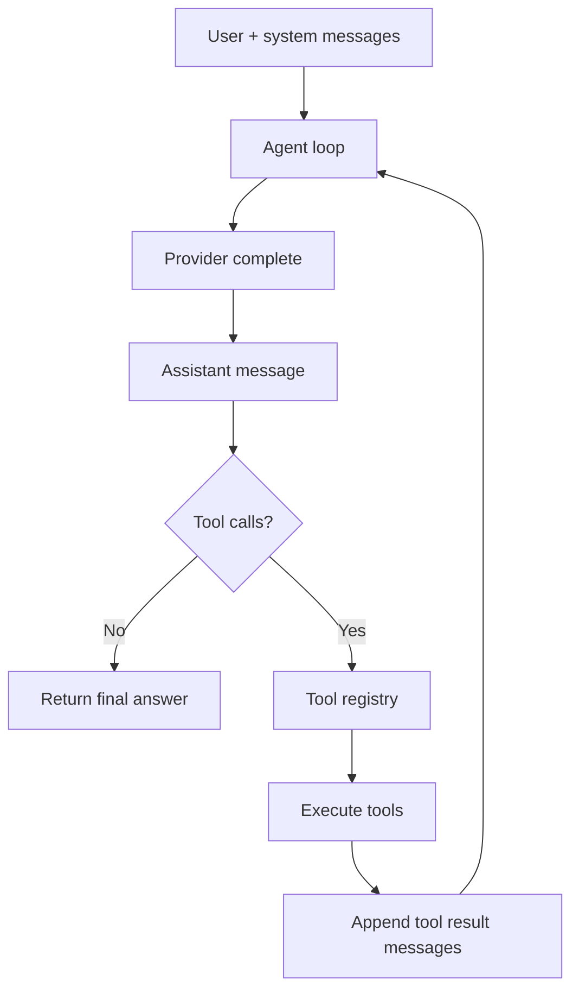

# 01. Agent Loop

The agent loop is provider-neutral. It does not know if the model is OpenAI, Anthropic, Gemini,
a local model, or a custom hosted endpoint.

## Flow



The loop is intentionally small: the provider decides what to say or call, and the registry is the only path from model output to real actions.

## Important production concerns

- `maxSteps` prevents infinite tool loops.
- `AbortSignal` stops long model/tool runs.
- event logs record every state transition.
- tool results are normalized so the model sees consistent output.
- failures are returned as structured tool results, not hidden exceptions.

## Build your own

Minimal pseudocode:

```ts
for (let step = 0; step < maxSteps; step++) {
  const response = await provider.complete({ messages, tools });
  messages.push(response.message);

  if (!response.message.toolCalls?.length) return response.message;

  for (const call of response.message.toolCalls) {
    const result = await registry.execute(call, context);
    messages.push({ role: "tool", content: JSON.stringify(result) });
  }
}
```

Then add cancellation, logging, permissions, timeouts, and persistence.
