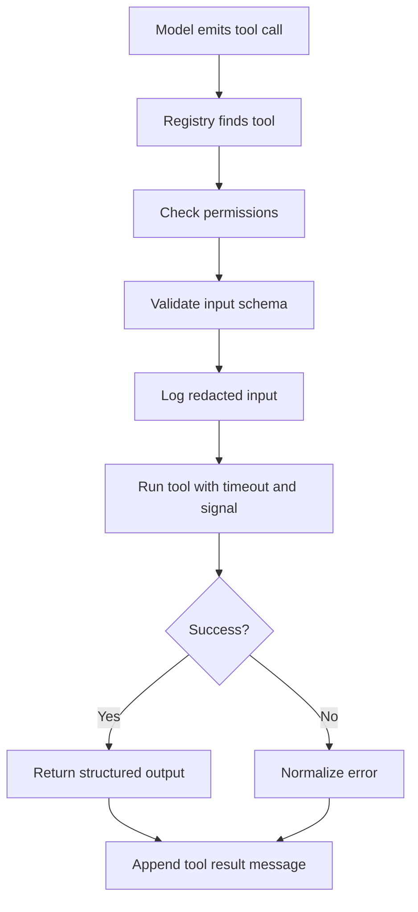

# 02. Tool Runtime

Tools are the system boundary between language and action.

Every tool should have:

- stable name
- natural-language description
- input schema
- permission requirements
- timeout
- runtime-independent implementation
- structured output

## Tool definition

```ts
defineTool({
  name: "read",
  inputSchema: z.object({ path: z.string() }),
  permissions: ["filesystem:read"],
  async execute(input, ctx) {
    return { content: await ctx.runtime.readTextFile(input.path) };
  },
});
```

## Why schemas matter

The model is not trusted to call tools correctly. Schema validation catches:

- missing required fields
- wrong types
- impossible enum values
- oversized inputs

## Permission model

Permissions are checked at runtime before execution. This lets you run:

- a full coding agent with read/write/shell permissions
- a repo-reader subagent with read-only permissions
- a browser-only agent with no filesystem access
- a review worker with Git read but no Git write

## Tool call lifecycle



This keeps unsafe or malformed model output from crossing the system boundary unchecked.

## Build your own

Implement:

1. `defineTool()`
2. `ToolRegistry.register()`
3. `ToolRegistry.execute()`
4. schema validation
5. permission checking
6. error normalization
7. event logging and redaction
