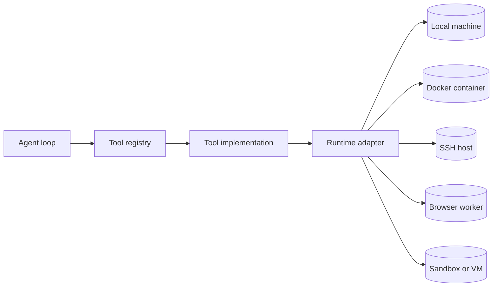

# 04. Runtime Adapters

Runtime adapters make tools portable.

The tool should not care whether a command runs locally, in Docker, over SSH, inside a hosted
sandbox, or not at all.

## Adapter interface

The runtime exposes capabilities:

- `readTextFile`
- `writeTextFile`
- `listDirectory`
- `findFiles`
- `grep`
- `runCommand`
- `startBackgroundCommand`
- `readBackgroundOutput`
- `killBackgroundCommand`
- `fetch`

Tools require capabilities at execution time. If a browser-only runtime has no filesystem, the
filesystem tools fail cleanly with a missing capability error.

## Boundary



Tools depend on the runtime interface, not the environment. Swapping adapters changes where work happens without changing the tool contract.

## Runtime examples

- local runtime: direct filesystem and shell access
- Docker runtime: command execution through `docker exec`
- SSH runtime: command execution through `ssh`
- browser-only runtime: fetch only

## Build your own

Create one adapter per environment. Keep the tool API stable.

```ts
const runtime = createMyRuntime({
  readTextFile,
  runCommand,
  fetch,
});
```

Then pass it into `ToolContext`.
